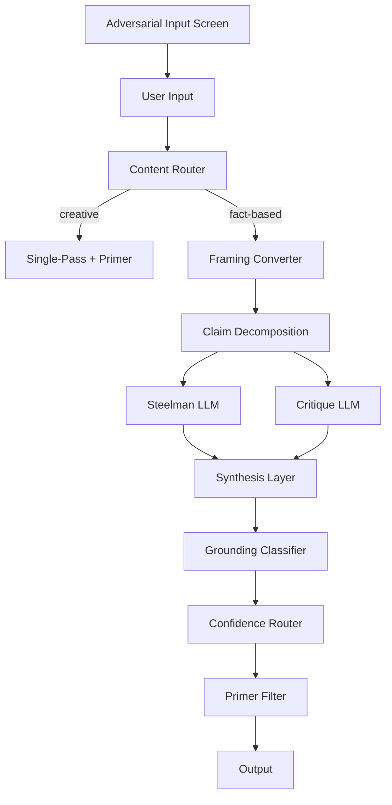

# Epistemic Correction Bot

A multi-node architecture for enforcing epistemic rigor by removing the model's discretion over when to apply constraints.

---

## What This Is

This is a design artifact, not a working implementation. It describes an architecture for processing claims through structured adversarial review, with the goal of reducing sycophancy and format drift in LLM outputs.

The core insight: behavioral constitutions embedded in prompts are subject to the model's judgment about what warrants rigor. The model can and will bypass them. The fix is to move constraints out of the model's discretionary space and into the harness.

This architecture addresses two specific failure modes: sycophancy (models defaulting to agreement and flattery) and format drift (models blending advocacy with criticism, dropping rigor when stakes seem low). It does not attempt to solve for shared training bias. For empirically resolvable claims, the architecture outsources verification to external APIs via a grounding classifier.

Version 0.2 adds an adversarial input screen, a content router, a claim decomposition layer, and a grounding classifier. A confidence-based cost router and provenance tagging on all output claims are also introduced.

The full design is documented in [`https://starbuckdev.github.io/epistemic-correction-bot/architecture.html`](architecture.html).

---

## How It's Supposed to Work

The pipeline is organized into four phases: Intake, Analysis, Grounding, and Presentation.

**Phase 1: Intake**

1. **Adversarial Input Screen** checks for prompt injection, jailbreak patterns, and attempts to use the steelman layer as a laundering vector for disinformation. Flags or rejects before any generation occurs. This runs before anything else and cannot be bypassed.

2. **User Input** — raw query submitted in first person. No framing constraints required of the user.

3. **Content Router** classifies the query as creative or fact-based. Creative queries (poems, narratives, brainstorming) bypass adversarial review entirely and route to a single-pass generation with the primer filter applied directly. Divergence analysis on creative output produces noise, not signal. Fact-based queries proceed through the full pipeline.

**Phase 2: Analysis**

4. **Framing Converter (Bengio Node)** strips first person and rephrases as "A colleague proposes X." This creates distance between the user and the claim, reducing the model's incentive to agree.

5. **Claim Decomposition** breaks complex queries into independent sub-claims before the adversarial instances run. Complex queries contain multiple propositions with different evidence bases. Without decomposition, synthesis cannot attribute divergence to specific sub-claims, and the steelman and critique instances end up arguing about different things simultaneously.

6. **LLM A (Steelman)** builds the strongest possible case for each sub-claim. Charitable interpretation. Assumes competent advocates exist.

7. **LLM B (Critique)** attacks the weakest assumptions and finds disconfirming evidence. Ways the claim could fail.

   Both instances run in parallel with no shared context. This is designed opposition, not duplicate runs with different temperatures.

8. **Synthesis Layer (Judge)** performs divergence analysis. It does not average or split the difference. It distinguishes four types of divergence: genuine uncertainty (preserve and surface), framing artifact (resolve without surfacing), asymmetric evidence (flag and attribute, do not average), and value difference (flag explicitly as values-based, not evidence-based).

   If the claim is "the earth is flat" and the critique correctly identifies overwhelming evidence for an oblate spheroid, the finding is not "truth somewhere in the middle." The finding is that the steelman side has no surviving evidence. Local flatness in Dallas is a separate, valid observation that does not support the original claim.

**Phase 3: Grounding**

9. **Grounding Classifier** identifies empirically resolvable claims after synthesis and routes them to external truth sources before uncertainty labeling is applied. Calculator API for quantitative claims, web search or retrieval for factual lookups, domain-specific databases by deployment configuration. This prevents the pipeline from applying calibrated uncertainty to questions that have known answers.

10. **Confidence Router** applies a cost threshold. High-confidence synthesis outputs with no empirical claims can skip the grounding call, reducing per-query cost. Threshold is configurable per deployment.

**Phase 4: Presentation**

11. **Primer Filter (Presentation Layer)** applies epistemic standards: confidence levels, fact vs. inference distinction, calibrated uncertainty. Shapes presentation only. Cannot correct errors introduced at synthesis or grounding layers.

12. **Output** is an epistemically labeled response showing explicit confidence levels, divergence flags, what survived both framings vs. what appeared in only one, provenance tags on all claims, and grounding attribution where external APIs were called.

---

## What This Does Not Solve

This architecture targets two specific failure modes: sycophancy (models defaulting to agreement and flattery) and format drift (models blending advocacy with criticism, dropping rigor when stakes seem low).

It does not solve for shared training bias. If all three generation calls (steelman, critique, and synthesis) share the same substrate bias, they may converge on the same wrong answer. The grounding classifier partially addresses this for empirically resolvable claims. For reasoning-heavy claims with no external ground truth, the problem remains open.

---

## Known Vulnerabilities

- **Shared training bias** — all three generation calls may converge on the same wrong answer. Convergence is not truth. No architectural mitigation currently exists for reasoning-heavy claims.
- **False neutrality** — synthesis of two biased outputs is not unbiased. A judge with the same training bias may misclassify disagreement.
- **Synthesis layer bias** — the judge is subject to the same substrate bias as the advocates. Misclassifying divergence type propagates errors downstream.
- **Claim decomposition error** (new in v0.2) — if the decomposer incorrectly splits or merges claims, the adversarial instances operate on malformed inputs. Errors compound through synthesis.
- **Grounding source bias** (new in v0.2) — routing a contested empirical claim to a biased or low-quality external source produces false grounding confidence. The grounding classifier should not be used to adjudicate questions where the authoritative source is itself disputed.
- **Primer reach limit** — the presentation layer cannot correct errors introduced at synthesis or grounding layers.
- **Cost per query** — each fact-based query requires 4-6 LLM calls. Partially addressed by the confidence router. Unit economics must justify the value proposition.
- **No feedback loop** — user-flagged errors have no correction intake path. Synthesis accuracy cannot improve over time. Planned for v0.3.

---

## What I Learned

This design emerged from testing a primer prompt that failed. The prompt specified rigorous epistemic standards. The model bypassed them when it judged the stakes too low. I call this rigor drift: the rigor itself drifts like all other context.

The lesson: constraints that live in the model's discretionary space are not hard constraints. They are suggestions. Architecture must externalize enforcement.

Building out v0.2 surfaced two additional structural problems. First, complex queries contain entangled propositions. Running a single steelman and a single critique against a multi-part question produces outputs that are hard to synthesize cleanly because the instances may be arguing about different sub-claims. Decomposition has to happen before the adversarial split, not after. Second, the pipeline was designed to handle uncertainty well but had no mechanism for resolving things that are not actually uncertain. Applying calibrated uncertainty to a calculable fact is its own epistemic failure. The grounding classifier exists to catch that.

The adversarial input screen came from thinking about the steelman layer as an attack surface. A pipeline designed to find the strongest case for any proposition will, if not screened, find the strongest case for disinformation. That is not a hypothetical. It is the most predictable misuse of the architecture and it had to be addressed before the grounding work.

---

## Origins

This design was developed iteratively with Claude and DeepSeek. The Bengio node is named after Yoshua Bengio's technique of rephrasing claims in third person to create distance and reduce sycophancy. The primer prompt referenced in the presentation layer is published as a separate project.

---

## Status

Design phase. Not implemented. Published as a statement of intent and an invitation to critique.
